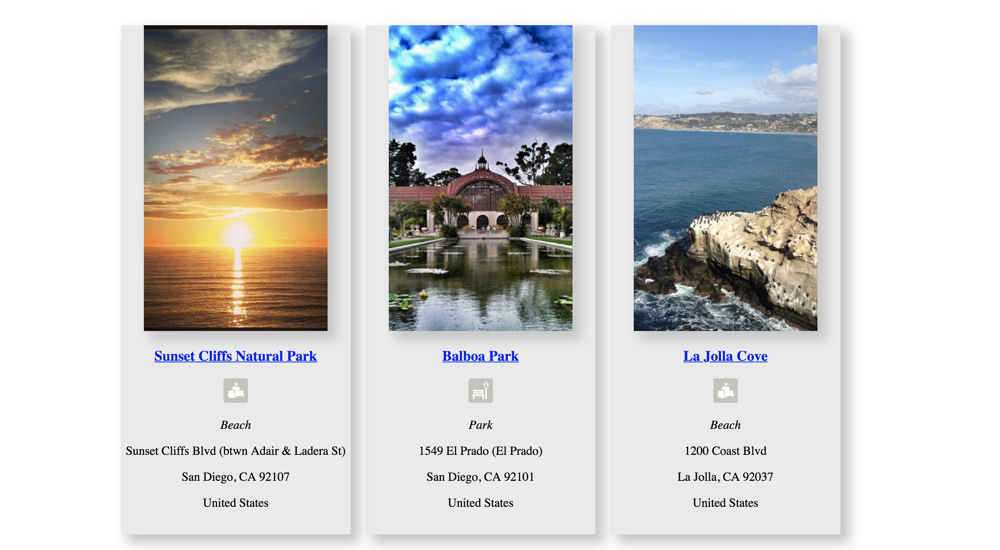

# Plan Your Day
An application to find out the weather and the best venues around you in any city in the world. 
The website pulls data from third-party API's: OpenWeatherMap.org and Foursquare.com

## About
The user is able to find out the current weather in any location in the world and also search
for venues around, sorted by categories. 
The user is provided with the photos for each venue, its address and the url to the venue's website.

## Screenshots
Landing page:

Weather page:

Venues page:

## Built With
- HTML5
- CSS
- jQuery
- JavaScript

The app is fully responsive.

## Demo
- [Live Demo](https://annasheik.github.io/Plan-your-day/)
